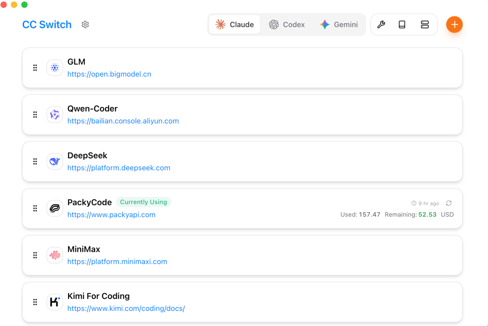
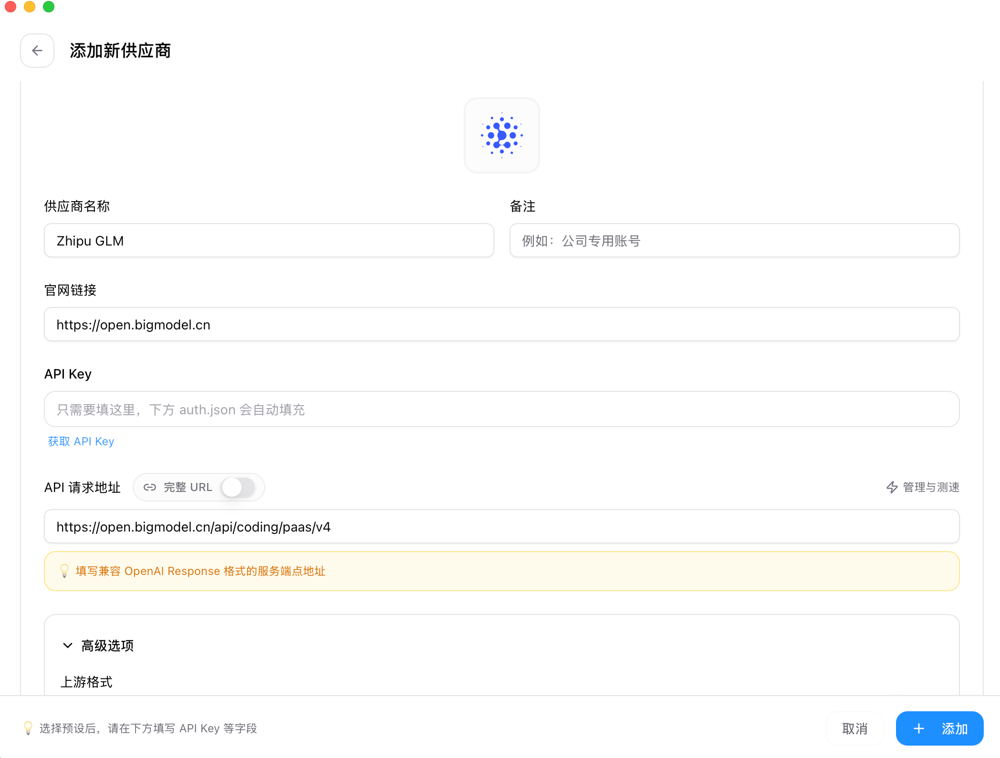
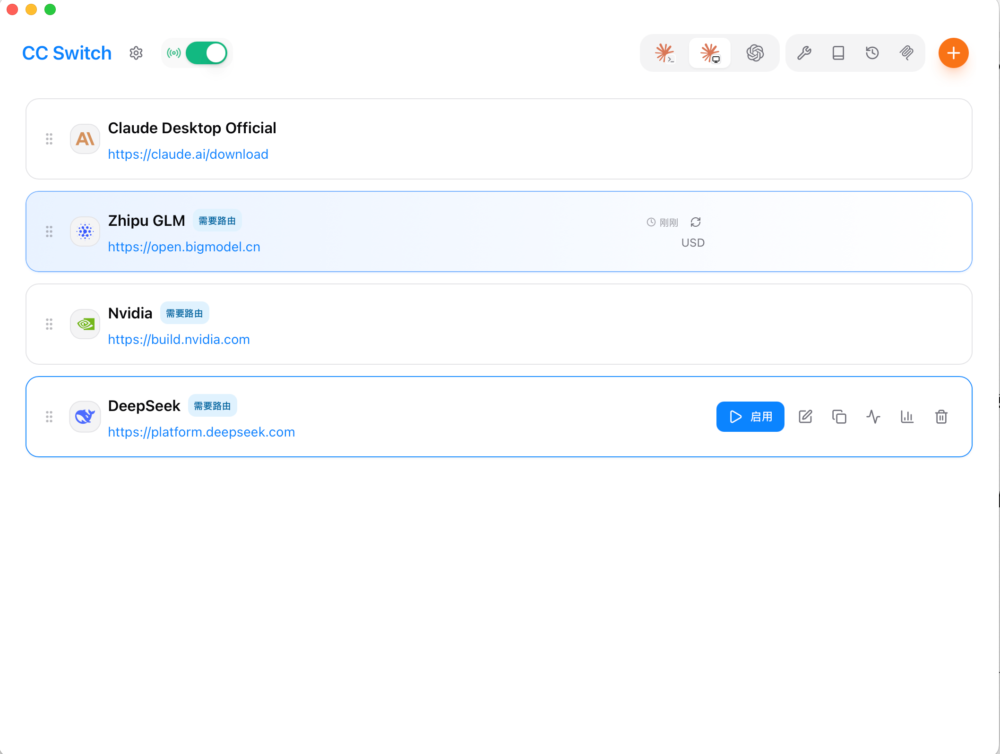
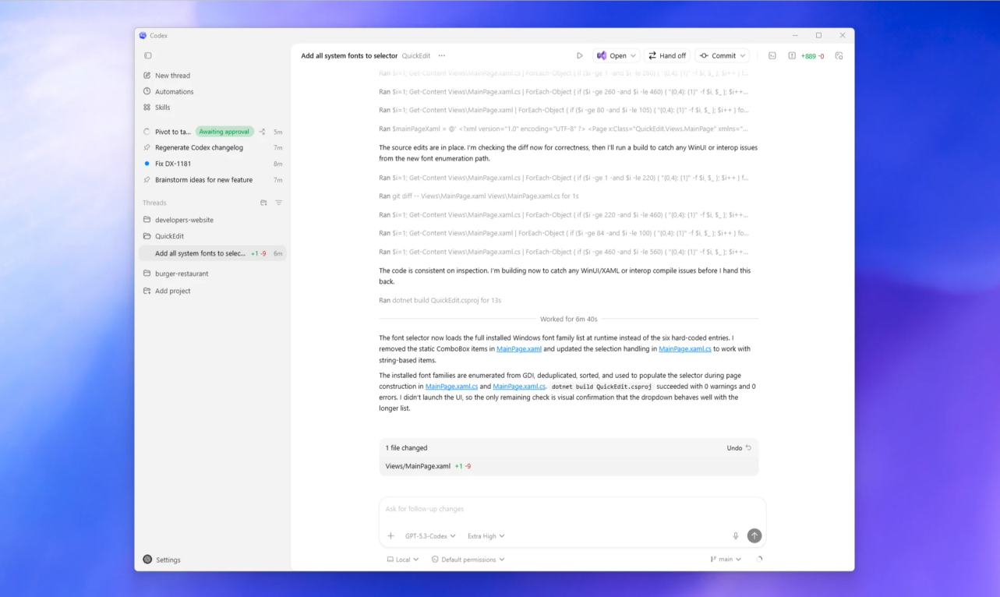
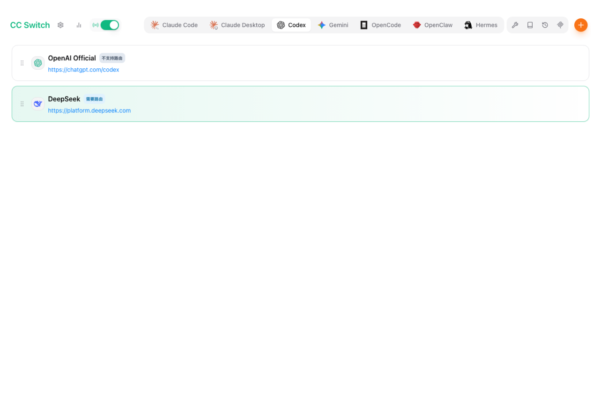
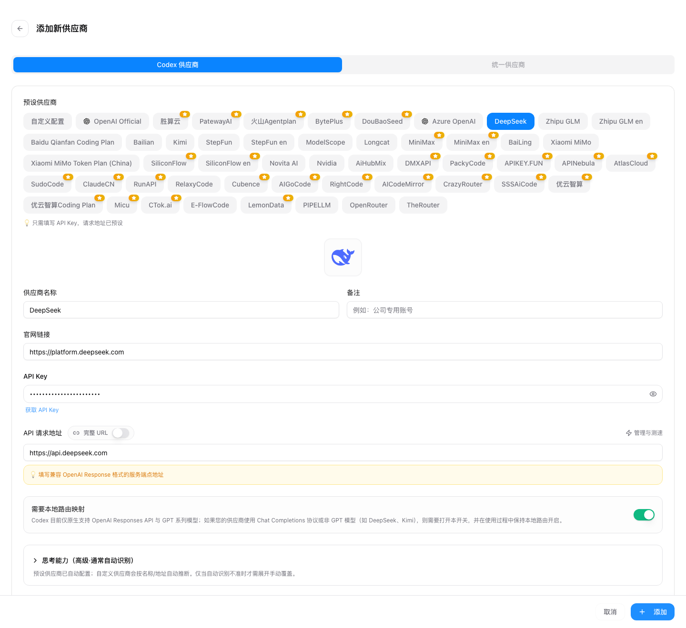

# Claude App 与 Codex App 通过 CC Switch 接入国产大模型教程

日期：2026-07-07
适用对象：想在 Claude 桌面 App 和 OpenAI Codex 桌面 App 中，通过 CC Switch 图形界面 接入 DeepSeek、智谱 GLM Coding Plan 或智谱 API 的用户。
本文不以 Claude Code CLI / Codex CLI 的日常使用为目标；但需要说明的是，Claude App / Codex App 的部分底层配置仍会复用本机配置文件，CC Switch 的作用就是用图形界面代替手动改配置。

## 1. 工具与下载链接

| 工具 | 用途 | macOS | Windows | 备注 |
| --- | --- | --- | --- | --- |
| Claude Desktop App | Claude 桌面端，含 Chat / Cowork / Code 等入口 | [Claude 下载页](https://claude.com/download) | [Claude 下载页](https://claude.com/download) | 下载页会自动提供 macOS、Windows x64、Windows arm64 版本。 |
| Codex App | OpenAI Codex 桌面端 | [Codex App 官方文档与下载页](https://developers.openai.com/codex/app)；Apple Silicon 直链：[Codex.dmg](https://persistent.oaistatic.com/codex-app-prod/Codex.dmg)；Intel 直链：[Codex-latest-x64.dmg](https://persistent.oaistatic.com/codex-app-prod/Codex-latest-x64.dmg) | [Codex App 官方文档与下载页](https://developers.openai.com/codex/app)；Microsoft Store：[Codex](https://apps.microsoft.com/detail/9plm9xgg6vks) | 官方文档显示 Codex App 已支持 macOS 与 Windows。 |
| CC Switch | 管理 Claude / Claude Desktop / Codex 等应用的供应商、模型、路由与用量 | [官网下载](https://ccswitch.io)；[GitHub Releases](https://github.com/farion1231/cc-switch/releases/latest) | [官网下载](https://ccswitch.io)；[GitHub Releases](https://github.com/farion1231/cc-switch/releases/latest) | 建议只从官网和 GitHub Releases 下载。 |
| DeepSeek | DeepSeek API Key 与模型 | [DeepSeek 平台](https://platform.deepseek.com/)；[API Key 页面](https://platform.deepseek.com/api_keys) | 同左 | 官方 OpenAI Base URL：https://api.deepseek.com；Anthropic Base URL：https://api.deepseek.com/anthropic。 |
| 智谱 GLM Coding Plan（中国大陆站） | 智谱 Coding Plan 套餐 | [GLM Coding Plan](https://bigmodel.cn/glm-coding)；[快速开始](https://docs.bigmodel.cn/cn/coding-plan/quick-start)；[API Key](https://bigmodel.cn/usercenter/proj-mgmt/apikeys) | 同左 | 中国大陆站 Coding Plan：Anthropic 端点 https://open.bigmodel.cn/api/anthropic；OpenAI Chat 端点 https://open.bigmodel.cn/api/coding/paas/v4。 |
| Z.AI / 智谱国际站 | Z.AI Coding Plan 与 API | [Z.AI](https://z.ai/)；[Quick Start](https://docs.z.ai/devpack/quick-start)；[API Keys](https://z.ai/manage-apikey/apikey-list) | 同左 | 国际站端点：Anthropic https://api.z.ai/api/anthropic；OpenAI Chat https://api.z.ai/api/coding/paas/v4。 |

## 2. 原理：为什么 Claude App 和 Codex App 的配置方式不一样

Claude App 更适合走 Anthropic Messages 兼容协议。DeepSeek 与智谱都提供 Anthropic 兼容端点，所以 Claude Desktop 侧优先使用 Anthropic 类型的预设或端点。

Codex App 更接近 OpenAI 自家工具链，新的 Codex 配置通常需要 OpenAI Responses API 形态。如果上游供应商只提供 OpenAI Chat Completions，例如 /chat/completions，直接把 Base URL 写进 Codex 往往会出现 /responses 404、400 或流式响应解析失败。因此，DeepSeek、智谱 OpenAI Chat 端点、Kimi、MiniMax 等 Chat 形态供应商接入 Codex 时，常见做法是让 Codex 访问本机 http://127.0.0.1:15721/v1，再由 CC Switch 本地路由把 Responses 请求转换为上游 Chat Completions 请求。

CC Switch v3.16.x 之后对一批具备原生 Responses 端点的国产模型供应商做了适配；若你使用的是这类预设，CC Switch 会在 Codex 侧生成模型目录，使 Codex 桌面端能看到自定义模型。存量配置看不到模型时，通常需要重新保存供应商并重启 Codex App。

## 3. 安装准备

### 3.1 macOS

- 安装 Claude App：打开 [Claude 下载页](https://claude.com/download)，下载 macOS 版本，拖入 Applications。
- 安装 Codex App：打开 [Codex App 官方下载页](https://developers.openai.com/codex/app)。Apple Silicon 机器选 Apple Silicon 版本，Intel Mac 选 Intel 版本。
- 安装 CC Switch：打开 [GitHub Releases](https://github.com/farion1231/cc-switch/releases/latest)，下载 CC-Switch-v版本号-macOS.dmg。如果安装后被 Gatekeeper 拦截，确认来源无误后右键打开。
- 准备 API Key：DeepSeek 在 [DeepSeek API Keys](https://platform.deepseek.com/api_keys) 创建；智谱在 Coding Plan 或 API Key 页面创建。团队版 Coding Plan 的 Key 可能与普通 API Key 不通用，应使用对应套餐页面生成的 Key。

### 3.2 Windows

- 安装 Claude App：打开 [Claude 下载页](https://claude.com/download)，按电脑架构选择 Windows x64 或 Windows arm64。
- 安装 Codex App：打开 [Codex App 官方下载页](https://developers.openai.com/codex/app)，或从 [Microsoft Store 的 Codex 页面](https://apps.microsoft.com/detail/9plm9xgg6vks) 安装。
- 安装 CC Switch：打开 [GitHub Releases](https://github.com/farion1231/cc-switch/releases/latest)，优先选择 CC-Switch-v版本号-Windows.msi；不想安装到系统可选 Portable zip。
- 准备 API Key：同 macOS。Windows 第一次启动本地路由时，如系统防火墙提示，允许 CC Switch 访问本机网络即可；这里主要是 127.0.0.1 本地转发。

## 4. CC Switch 基本界面

安装后打开 CC Switch，顶部会看到多个应用入口，例如 Claude Code、Claude Desktop、Codex、Gemini 等。本文只用两个：

- 接入 Claude 桌面 App：选择 Claude Desktop。
- 接入 Codex 桌面 App：选择 Codex。

不要把 Claude Desktop 和 Claude Code 混用。Claude Code 侧配置主要影响终端、VS Code 扩展或 Claude Code 运行环境；Claude Desktop 才是本文所说 Claude App。



*CC Switch 主界面示意*

添加供应商时，右上角点击加号，选择预设，填入 API Key。预设会尽量自动填好 Base URL、模型名和协议格式。



*CC Switch 添加供应商界面示意*

## 5. Claude App 接入 DeepSeek

### 5.1 操作步骤

- 打开 CC Switch。
- 顶部应用切换到 Claude Desktop。
- 点击右上角 +。
- 在供应商预设中选择 DeepSeek。如果没有 DeepSeek 预设，选择 Custom Configuration。
- 填入 DeepSeek API Key。
- 检查或填写以下关键字段：

```text
Provider：DeepSeek
API Format：Anthropic Messages / Anthropic Compatible
Base URL：https://api.deepseek.com/anthropic
API Key：sk-...（你的 DeepSeek Key）
模型：deepseek-v4-pro 或 deepseek-v4-flash
```

- 保存供应商。
- 回到 Claude Desktop 供应商列表，点击该供应商的 Enable / 使用 / 切换。打开路由！
- 完全退出 Claude App，然后重新打开。
- 进入 Claude App 的 Code 或 Chat 相关入口，发送一个简单任务测试，例如：

```text
请用 Python 写一个最小 FastAPI 服务，并解释每一段代码的作用。
```



### 5.2 判断是否接入成功

优先看 CC Switch 的用量记录或请求日志，而不是让模型自报名称。模型自报名称不可靠。若请求数增加、无 401/404/400，基本说明链路可用。

### 5.3 常见问题

如果 Claude App 仍然走官方 Claude 模型，通常是以下原因：

- 你在 CC Switch 里配置了 Claude Code，而不是 Claude Desktop。
- 切换供应商后没有重启 Claude App。
- 该供应商在 Claude Desktop 下需要本地路由，但 CC Switch 的 Local Routing 没有保持运行。
- API Key 填错，或 DeepSeek 账户余额不足。

## 6. Claude App 接入智谱 GLM Coding Plan / 智谱 API

智谱有中国大陆站和 Z.AI 国际站，两者端点不同。不要混用。

### 6.1 中国大陆站 GLM Coding Plan

在 CC Switch 的 Claude Desktop 里添加 Zhipu GLM / 智谱 GLM 预设。若选择自定义配置，按以下填写：

```text
Provider：Zhipu GLM Coding Plan
API Format：Anthropic Messages / Anthropic Compatible
Base URL：https://open.bigmodel.cn/api/anthropic
API Key：从 GLM Coding Plan 对应页面生成的 Key
模型：按 CC Switch 预设；如需手动填，优先参考智谱当前文档与套餐页
```

智谱文档说明，个人版套餐用户应在“个人编程套餐 > 套餐概览”中新建 API Key；团队版成员应在“团队编程套餐 > 我的套餐”中获取 API Key，团队套餐 Key 与平台其他 API Key 不通用。

### 6.2 Z.AI 国际站 GLM Coding Plan

如果你使用的是 Z.AI 国际站：

```text
Provider：Z.AI GLM Coding Plan
API Format：Anthropic Messages / Anthropic Compatible
Base URL：https://api.z.ai/api/anthropic
API Key：从 Z.AI Coding Plan / API Keys 页面生成的 Key
```

### 6.3 操作步骤

- CC Switch 顶部选择 Claude Desktop。
- 点击 + 添加供应商。
- 优先选择 Zhipu GLM、Z.ai GLM 或类似预设。
- 填入正确的 Coding Plan Key 或 API Key。
- 保存并启用。
- 重启 Claude App。
- 用一个简单代码任务测试，并查看 CC Switch 请求日志。

## 7. Codex App 接入 DeepSeek

DeepSeek 官方 OpenAI 兼容端点是 https://api.deepseek.com，Chat API 路径是 /chat/completions。Codex App 侧通常需要 Responses 形态，因此不要把 https://api.deepseek.com/chat/completions 直接写成 Codex 的 Base URL。应使用 CC Switch 的 Codex 预设与本地路由。

### 7.1 第一次启动 Codex App

先打开 Codex App，登录 ChatGPT 账号或 OpenAI API Key，选择一个项目目录，进入主界面。这样做的目的是让 Codex 在本机生成必要配置。之后退出 Codex App。

Codex 官方界面示意：



*Codex App Windows 界面示意*

### 7.2 在 CC Switch 添加 DeepSeek Codex 供应商

- 打开 CC Switch。
- 顶部选择 Codex。
- 点击右上角 +。
- 选择 DeepSeek 预设。
- 填入 DeepSeek API Key。
- 保存。

供应商列表中如果出现“需要路由 / Needs Routing”一类提示，这是正常的，说明该供应商需要 CC Switch 本地路由做协议转换。



*Codex 供应商需要本地路由示意*

添加 DeepSeek Codex 供应商时，预设会自动填好 API 请求地址、默认模型、推理参数，并启用需要本地路由的配置。不要把完整路径 /chat/completions 手动拼进 Base URL。



*DeepSeek Codex 供应商表单示意*

### 7.3 开启 Local Routing

- 进入 CC Switch 的 设置 / Settings。
- 找到 路由 / Routing。
- 打开本地路由总开关。
- 在 Routing Enabled 中开启 Codex。
- 默认本地地址通常是：

```text
http://127.0.0.1:15721
```

- 返回 Codex 供应商列表，启用 DeepSeek 供应商。
- 重新打开 Codex App。
- 选择项目，发一个简单任务测试。


*开启 Codex 本地路由示意*

### 7.4 验证

在 CC Switch 的路由面板或用量记录中查看请求数。如果 Codex App 能正常返回，且 CC Switch 记录到 DeepSeek 供应商请求，说明接入完成。

## 8. Codex App 接入智谱 GLM Coding Plan / 智谱 API

### 8.1 中国大陆站

如果使用智谱中国大陆站 Coding Plan 的 OpenAI Chat 端点：

```text
Provider：Zhipu GLM Coding Plan
API Format：OpenAI Chat Completions（如 CC Switch 标注 requires routing，则必须开本地路由）
Base URL：https://open.bigmodel.cn/api/coding/paas/v4
API Key：GLM Coding Plan 对应 Key
```

如果 CC Switch 的最新预设中该供应商已支持原生 Responses，按预设保存即可；看不到模型时，重新保存供应商并重启 Codex App。

### 8.2 Z.AI 国际站

如果使用 Z.AI 国际站 Coding Plan：

```text
Provider：Z.AI GLM Coding Plan
API Format：OpenAI Chat Completions（如预设提示 requires routing，则开启本地路由）
Base URL：https://api.z.ai/api/coding/paas/v4
API Key：Z.AI Coding Plan Key
```

### 8.3 操作步骤

- 先打开一次 Codex App，登录并选择项目目录，然后退出。
- 打开 CC Switch。
- 顶部选择 Codex。
- 点击 + 添加供应商。
- 优先选 Zhipu GLM、Z.ai GLM、Baidu Qianfan Coding Plan、Qwen Coder 等预设中与你购买渠道一致的选项。不要看到“GLM”就随便选，国内站与国际站、Coding Plan 与普通 API 可能不是同一套 Key。
- 填入 Key，保存。
- 如果供应商卡片提示需要路由，进入 Settings → Routing 开启本地路由总开关，并打开 Codex。
- 返回供应商列表，启用该供应商。
- 重启 Codex App 后测试。

## 9. macOS 与 Windows 的差异

| 项目 | macOS | Windows |
| --- | --- | --- |
| Claude App 安装包 | 通常为 .dmg | 通常为 .exe / .msix / 安装器 |
| Codex App 安装 | Apple Silicon 与 Intel 分不同 dmg | Microsoft Store 或官方跳转安装 |
| CC Switch 安装 | 推荐 .dmg；也可能有 .tar.gz | 推荐 .msi；也可能有 Portable zip |
| 配置文件路径 | ~/.codex/config.toml、~/.claude/settings.json | %USERPROFILE%\.codex\config.toml、%USERPROFILE%\.claude\settings.json |
| 本地路由地址 | http://127.0.0.1:15721 | 同左 |
| 常见阻断 | Gatekeeper、权限、未重启 App | 防火墙提示、安装架构选错、Store 安装未完成 |

正常情况下，不需要手动改这些配置文件。只有排查问题时才建议查看。

## 10. 常见报错与处理

### 10.1 Codex 报 404：找不到 /responses

原因通常是把只支持 Chat Completions 的上游直接写给了 Codex。处理方式：

- 回到 CC Switch 的 Codex 供应商配置。
- 确认该供应商 API Format 是 OpenAI Chat Completions，并启用本地路由。
- 确认 Settings → Routing 中 Codex 已开启。
- 重启 Codex App。

### 10.2 DeepSeek 上游报 404

常见原因是 Base URL 写错。DeepSeek 的 OpenAI Base URL 是：

```text
https://api.deepseek.com
```

不要写成：

```text
https://api.deepseek.com/chat/completions
```

后者是接口路径，不适合作为 CC Switch 预设的 Base URL。

### 10.3 Codex App 看不到自定义模型

处理顺序：

- 升级 CC Switch 到最新版本。
- 打开该 Codex 供应商，重新保存一次。
- 退出并重新打开 Codex App。
- 检查 CC Switch 是否已生成模型目录，例如：

```text
~/.codex/cc-switch-model-catalog.json
```

Windows 对应路径：

```text
%USERPROFILE%\.codex\cc-switch-model-catalog.json
```

### 10.4 Claude App 重启后仍没有变化

处理顺序：

- 确认 CC Switch 顶部选的是 Claude Desktop。
- 确认供应商已启用。
- 如该供应商需要代理，确认 Local Routing 仍在运行。
- 完全退出 Claude App，而不是只关闭窗口。
- 再次打开 Claude App 测试。

### 10.5 401 / Unauthorized

通常是 API Key 错误、Key 类型不匹配、套餐未开通、余额不足或复制时带了空格。智谱团队版尤其要注意：团队套餐 Key 与普通 API Key 可能不通用。

## 11. 推荐配置选择

### 11.1 Claude App

| 供应商 | 推荐协议 | Base URL |
| --- | --- | --- |
| DeepSeek | Anthropic Messages | https://api.deepseek.com/anthropic |
| 智谱中国大陆站 Coding Plan | Anthropic Messages | https://open.bigmodel.cn/api/anthropic |
| Z.AI 国际站 Coding Plan | Anthropic Messages | https://api.z.ai/api/anthropic |

### 11.2 Codex App

| 供应商 | 推荐协议 | Base URL | 是否通常需要本地路由 |
| --- | --- | --- | --- |
| DeepSeek | OpenAI Chat Completions | https://api.deepseek.com | 是 |
| 智谱中国大陆站 Coding Plan | OpenAI Chat Completions 或 CC Switch 原生预设 | https://open.bigmodel.cn/api/coding/paas/v4 | 视预设而定 |
| Z.AI 国际站 Coding Plan | OpenAI Chat Completions 或 CC Switch 原生预设 | https://api.z.ai/api/coding/paas/v4 | 视预设而定 |

原则是：Claude App 优先 Anthropic 兼容端点；Codex App 优先 Responses 兼容端点，没有 Responses 时让 CC Switch 本地路由转换。

## 12. 安全与合规提示

- 不要把客户合同、诉讼材料、源代码仓库、个人信息直接发送给不明中转服务。
- 尽量使用官方 API 或你能核验主体、合同、发票、SLA 与数据处理条款的服务。
- 给不同用途建立不同 API Key，必要时按客户、项目或团队隔离。
- 不要把 API Key 写入仓库，不要截图发群，不要复制到不明网页。
- CC Switch 只应从 ccswitch.io 和 github.com/farion1231/cc-switch 获取。任何要求充值、索取 Claude / ChatGPT 登录凭证的所谓 CC Switch 网站都不应使用。
- 对法律、金融、客户秘密项目，建议优先采用企业版、私有化部署、合规网关或至少可审计的 API 平台。

## 13. 一页版流程

### Claude App + DeepSeek / 智谱

```text
安装 Claude App → 安装 CC Switch → 打开 CC Switch → 选择 Claude Desktop → 添加 DeepSeek / Zhipu GLM 预设 → 填 API Key → 保存 → 启用供应商 → 重启 Claude App → 测试 → 查看 CC Switch 日志
```

### Codex App + DeepSeek / 智谱

```text
安装 Codex App → 打开一次并选择项目 → 安装 CC Switch → 选择 Codex → 添加 DeepSeek / Zhipu GLM 预设 → 填 API Key → 如提示需要路由，开启 Settings → Routing → Codex → 启用供应商 → 重启 Codex App → 测试 → 查看 CC Switch 日志
```
