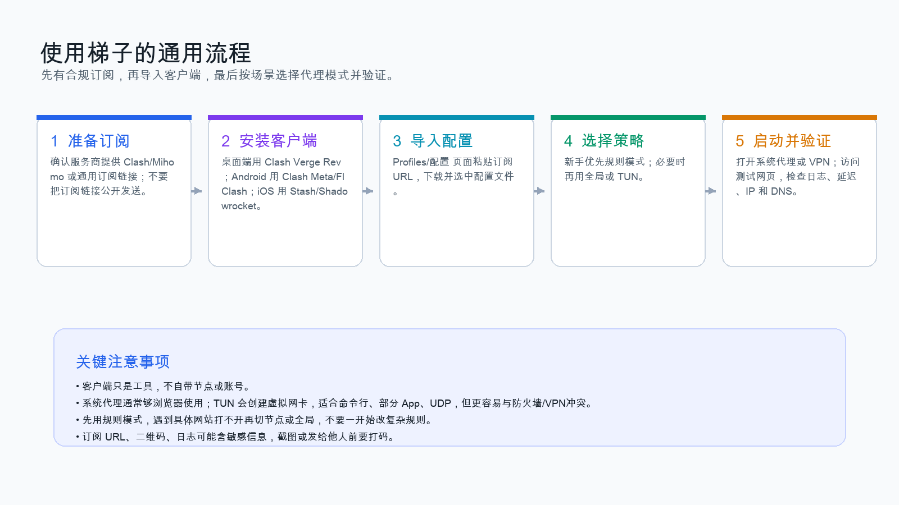
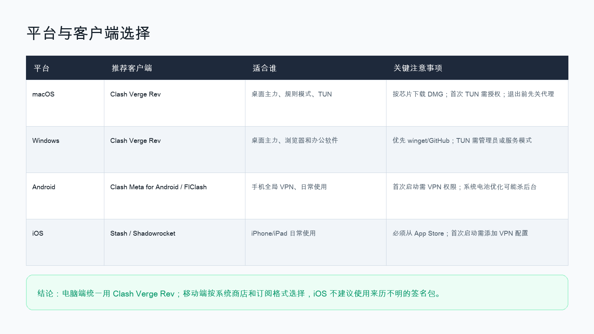
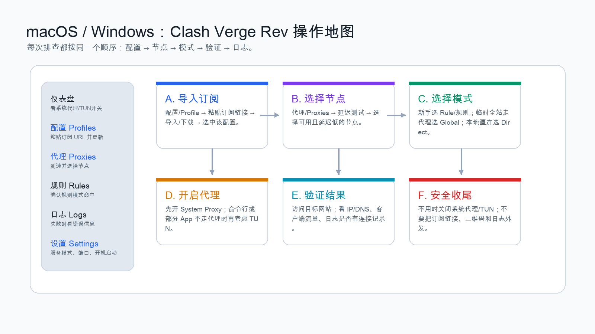
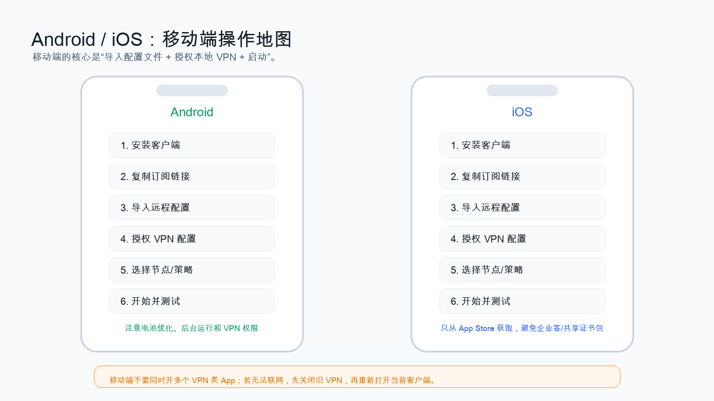
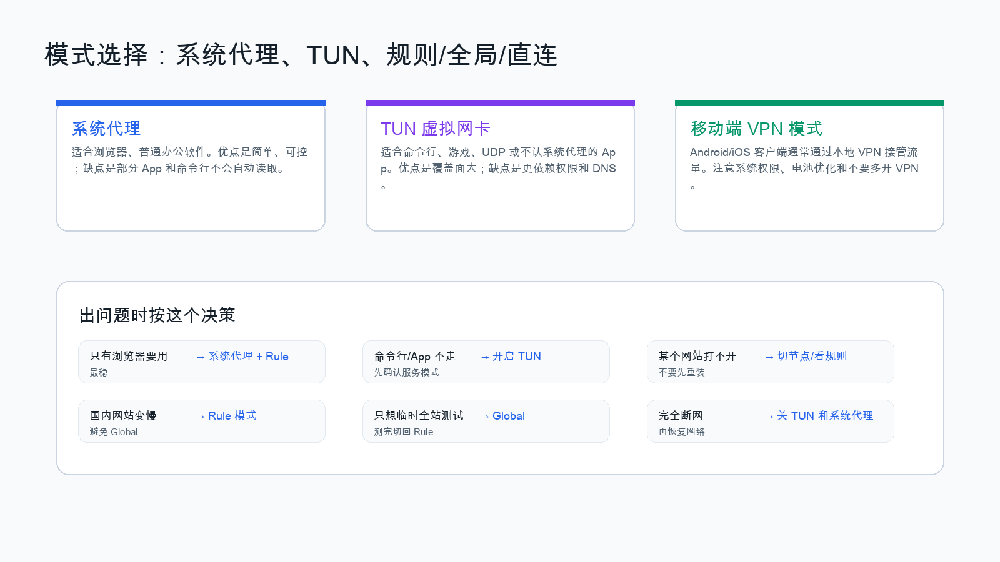
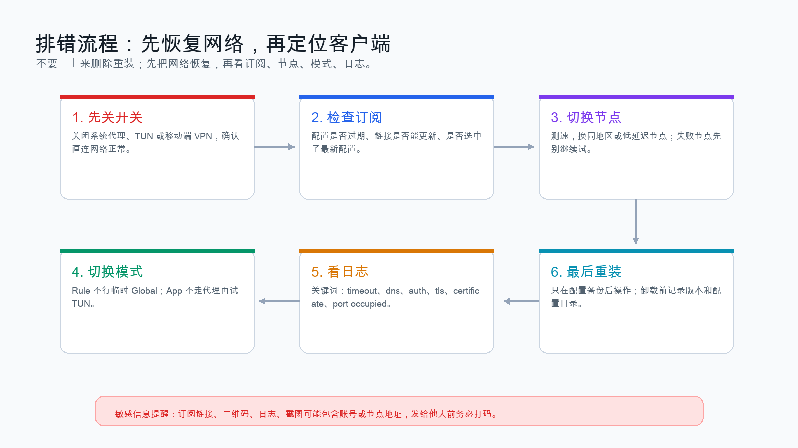

# 梯子使用全教程：macOS、Windows、Android、iOS

生成日期：2026-07-07  
适用对象：需要在合法合规前提下使用代理/VPN 类工具访问授权网络资源的用户  
桌面端主工具：Clash Verge Rev  
移动端参考工具：Android 使用 FlClash / Clash Meta for Android；iOS 使用 Stash / Shadowrocket

## 1. 使用边界与重要说明

1. 本教程只说明客户端安装、订阅导入、模式选择、日常验证和排错方法。
2. 本教程不提供节点购买、机场推荐、自建服务端、规避监管、隐藏违法行为或绕过单位安全制度的方法。
3. 请仅在当地法律法规、单位制度、客户保密要求和服务商条款允许范围内使用。
4. 律师工作中不要把客户材料、合同、尽调底稿、证照、裁判文书、内部邮件等传给不可信服务商或不明节点。
5. 不要随便安装根证书、开启 MITM、HTTPS 解密、重写脚本等功能；这些功能可能读取或修改你的网络请求，不适合普通法律工作场景。
6. 订阅链接、二维码、节点地址、日志、截图都可能包含敏感信息，转发给他人或放进工作底稿前必须打码。



## 2. 先理解几个概念

| 概念 | 含义 | 新手建议 |
| --- | --- | --- |
| 客户端 | 安装在电脑/手机上的代理工具，例如 Clash Verge Rev、Stash | 客户端本身通常不自带节点 |
| 订阅链接 | 服务商提供的配置 URL，里面包含节点、规则、策略组等 | 不要公开，不要发给陌生人 |
| 节点 | 实际用于转发流量的服务器 | 先选延迟低、稳定的节点 |
| 策略组 | 一组节点的选择器，例如 `Proxy`、`Auto`、`HK`、`US` | 新手优先选 `Auto` 或手动选稳定节点 |
| Rule / 规则模式 | 按规则决定哪些流量走代理、哪些直连 | 日常首选 |
| Global / 全局模式 | 所有流量都尽量走代理 | 临时测试用，不建议长期使用 |
| Direct / 直连模式 | 不走代理 | 用于恢复网络或测试 |
| System Proxy / 系统代理 | 改操作系统代理设置，浏览器通常能用 | 桌面端新手首选 |
| TUN 模式 | 创建虚拟网卡，接管更多程序流量 | 命令行、部分 App 不走代理时再用 |
| VPN 权限 | Android/iOS 上客户端通过系统 VPN 接管流量 | 一次只开一个 VPN 类 App |

## 3. 软件选择总览



| 平台 | 推荐 | 备用 | 备注 |
| --- | --- | --- | --- |
| macOS | Clash Verge Rev | Stash for Mac / FlClash | 本教程桌面端以 Clash Verge Rev 为主 |
| Windows | Clash Verge Rev | FlClash | Windows 可用 winget 安装 Clash Verge Rev |
| Android | FlClash | Clash Meta for Android | 优先下载官方 Release；安装 APK 要谨慎 |
| iOS | Stash | Shadowrocket / Quantumult X / Loon | 只从 App Store 获取，不建议企业签或来历不明安装包 |

## 4. 准备工作

开始前准备：

1. 一个合规取得的订阅链接。
2. 电脑或手机管理员/解锁权限。
3. 可访问的官方软件下载地址。
4. 基本网络连接，先确保不用代理时能正常上网。
5. 如在单位或律所网络内使用，先确认 IT 安全制度是否允许。

订阅链接通常长这样：

```text
https://example.com/api/v1/client/subscribe?token=xxxxxxxx
```

不要这样做：

1. 不要把订阅链接发到群里。
2. 不要截图露出二维码或 URL token。
3. 不要把多个客户项目的访问都长期放在同一个不可信代理环境中。
4. 不要使用来历不明的“免费节点”处理法律工作。

## 5. macOS：Clash Verge Rev 完整步骤

### 5.1 下载

官方入口：

1. Clash Verge Rev 文档：<https://www.clashverge.dev/install.html>
2. GitHub Releases：<https://github.com/clash-verge-rev/clash-verge-rev/releases>

下载时按芯片选择：

| 机器类型 | 选择 |
| --- | --- |
| Apple Silicon，例如 M1/M2/M3/M4 | `aarch64`、`arm64` 或 Apple M 对应 DMG |
| Intel Mac | `x64` 或 Intel 对应 DMG |

注意事项：

1. 官方文档提示 macOS 需要较新的系统版本，老旧系统可能不支持。
2. 只从官方 GitHub Release 或官方文档跳转下载。
3. 不要下载网盘二次打包版、破解修改版。

### 5.2 安装

1. 双击 `.dmg`。
2. 将 Clash Verge Rev 拖入 `Applications` / “应用程序”。
3. 打开“应用程序”中的 Clash Verge Rev。
4. 如果 macOS 提示“无法验证开发者”：
   1. 先确认安装包来源是官方 Release；
   2. 打开“系统设置”；
   3. 进入“隐私与安全性”；
   4. 找到被拦截的 Clash Verge Rev；
   5. 点击“仍要打开”。

### 5.3 导入订阅



1. 打开 Clash Verge Rev。
2. 进入 `Profiles` / “配置”。
3. 点击 `+`、`Import`、`New` 或类似按钮。
4. 选择 `URL` / “远程订阅”。
5. 在名称处填写容易识别的名称，例如：

```text
工作订阅-主用
```

6. 在 URL 处粘贴订阅链接。
7. 点击 `Save` / `Import` / “保存”。
8. 点击该配置旁边的 `Update` / “更新”。
9. 确认配置列表中该配置已成功下载。
10. 点击该配置，使其成为当前启用配置。

如果导入失败：

1. 检查订阅链接是否复制完整。
2. 检查链接是否已经过期。
3. 用浏览器打开订阅链接，看是否能下载配置文件。
4. 不要把订阅链接发给别人代查，除非已经打码 token。

### 5.4 选择节点和策略

1. 进入 `Proxies` / “代理”。
2. 找到主策略组，常见名称包括：
   1. `Proxy`
   2. `Auto`
   3. `节点选择`
   4. `国外网站`
   5. `Global`
3. 点击测速按钮，等待延迟结果。
4. 选择延迟低、可用、稳定的节点。
5. 新手可先选 `Auto`，让客户端自动选可用节点。

注意事项：

1. 延迟低不等于一定最快，但可以作为第一筛选。
2. 如果某个网站打不开，先换节点，不要马上重装软件。
3. 如果服务商提供多个地区，优先选择距离近、线路稳定的地区。

### 5.5 开启系统代理

1. 回到 `General` / “首页” / “设置”页面。
2. 打开 `System Proxy` / “系统代理”。
3. 保持 `Mode` 为 `Rule` / “规则模式”。
4. 打开浏览器测试目标网站。
5. 返回 Clash Verge Rev 看是否有流量变化。

新手推荐：

```text
Rule 模式 + System Proxy
```

不要一开始就开：

```text
Global 模式 + TUN + 自定义 DNS + 多个覆写规则
```

这样出问题时很难排查。

### 5.6 macOS 开启 TUN 模式

只有在以下情况再考虑 TUN：

1. 浏览器能用，但命令行、终端、某些 App 不走代理。
2. 某些软件不读取系统代理。
3. 需要 UDP 或更完整的流量接管。

步骤：

1. 先关闭其他 VPN 类软件。
2. Clash Verge Rev 中进入 `Settings` / “设置”。
3. 找到 `Service Mode` / “服务模式”。
4. 点击安装服务或启动服务。
5. 根据 macOS 提示输入密码授权。
6. 找到 `TUN Mode` / “TUN 模式”。
7. 打开 TUN。
8. 保持模式为 `Rule`。
9. 测试浏览器和需要使用代理的 App。

注意事项：

1. TUN 会创建虚拟网卡，可能与其他 VPN、安全软件、防火墙冲突。
2. 开 TUN 后完全断网时，先关闭 TUN，再关闭系统代理，然后恢复网络。
3. 不建议把 TUN、其他 VPN、公司零信任客户端长期同时开启。

### 5.7 macOS 关闭与恢复

不用时建议：

1. 关闭 `TUN Mode`。
2. 关闭 `System Proxy`。
3. 退出 Clash Verge Rev。
4. 打开系统网络设置，确认代理没有残留。

如果退出后浏览器仍不能上网：

1. 打开“系统设置”。
2. 进入“网络”。
3. 选择当前 Wi-Fi 或以太网。
4. 查看“代理”。
5. 关闭 HTTP、HTTPS、SOCKS 代理。
6. 重新连接 Wi-Fi。

## 6. Windows：Clash Verge Rev 完整步骤

### 6.1 下载与安装

优先方式：winget。

```powershell
winget install ClashVergeRev.ClashVergeRev
```

备用方式：

1. 打开官方 Releases：<https://github.com/clash-verge-rev/clash-verge-rev/releases>
2. 下载 Windows `x64` 安装包。
3. 如果你的电脑是 ARM Windows，再选择 arm64 包。
4. 如面板无法打开，可参考官方文档中关于 WebView2 / `fix_webview2` 包的说明。

注意事项：

1. Windows 7 不建议使用，现版本主要面向 Windows 10/11。
2. 不要安装来源不明的绿色版、破解版。
3. 安装后如果 Windows Defender 拦截，先核对来源和签名，不要盲目放行。

### 6.2 导入订阅

步骤同 macOS：

1. 打开 Clash Verge Rev。
2. 进入 `Profiles` / “配置”。
3. 新建 URL 订阅。
4. 粘贴订阅链接。
5. 保存并更新。
6. 选中该配置。

### 6.3 选择节点

1. 进入 `Proxies` / “代理”。
2. 点击测速。
3. 选择可用节点或 `Auto`。
4. 保持 `Rule` / 规则模式。

### 6.4 开启系统代理

1. 打开 `System Proxy`。
2. 浏览器访问目标网站。
3. 打开 Clash Verge Rev 日志，看是否有连接记录。

Windows 注意事项：

1. Clash Verge Rev 打开系统代理后，会修改 Windows 代理设置。
2. 如果软件异常退出，Windows 代理可能残留。
3. 断网时先关闭 Clash Verge Rev 的系统代理，再检查 Windows 系统代理。

检查 Windows 代理：

1. 打开“设置”。
2. 进入“网络和 Internet”。
3. 进入“代理”。
4. 关闭不需要的手动代理。

### 6.5 Windows 开启 TUN 模式

适用场景：

1. 浏览器可以用，但某些 App 不走代理。
2. 终端命令、开发工具、部分桌面软件无法通过系统代理访问。
3. 需要更完整的流量接管。

步骤：

1. 以管理员权限运行 Clash Verge Rev，或按软件提示安装服务模式。
2. 进入 `Settings` / “设置”。
3. 安装或启用 `Service Mode`。
4. 打开 `TUN Mode`。
5. 保持 `Rule` 模式。
6. 测试浏览器和目标 App。

注意事项：

1. TUN 可能被杀毒软件、防火墙、公司安全客户端拦截。
2. Windows Store / UWP 应用可能涉及 loopback 限制，遇到问题再查对应设置，不要一开始就全局修改。
3. 如果完全断网，先关 TUN，再关系统代理，再重启客户端。

### 6.6 Windows 常见恢复命令

查看代理：

```powershell
netsh winhttp show proxy
```

重置 WinHTTP 代理：

```powershell
netsh winhttp reset proxy
```

刷新 DNS：

```powershell
ipconfig /flushdns
```

重启网络适配器可以通过“设置”或“控制面板”完成，不建议不明原因时随意重置整个网络。

## 7. Android：FlClash / Clash Meta for Android



### 7.1 客户端选择

推荐顺序：

1. FlClash：跨平台、界面较新、GitHub Release 更新较活跃。
2. Clash Meta for Android：如果你的订阅服务商明确提供对应教程，可以使用。

参考：

1. FlClash Releases：<https://github.com/chen08209/FlClash/releases>
2. Clash Meta for Android Releases：<https://github.com/MetaCubeX/ClashMetaForAndroid/releases>

### 7.2 安装 APK

1. 用手机浏览器打开官方 Release 页面。
2. 下载适合手机架构的 APK。
3. 大多数现代安卓手机选择：

```text
android-arm64-v8a.apk
```

4. 下载完成后点击安装。
5. 如系统提示“不允许安装未知应用”：
   1. 确认 APK 来源是官方 GitHub Release；
   2. 进入系统设置；
   3. 允许当前浏览器或文件管理器安装未知应用；
   4. 安装完成后，建议关闭该权限。

注意事项：

1. 不要从网盘、论坛、短链接下载修改版 APK。
2. 安装包权限异常、要求通讯录/短信/无关权限时，不要继续使用。
3. 如果不确定架构，优先选择 `arm64-v8a`，老设备再考虑 `armeabi-v7a`。

### 7.3 导入订阅

以通用 Clash 类 Android 客户端为例：

1. 打开 App。
2. 进入 `Profiles` / `配置`。
3. 点击 `+`。
4. 选择 `URL` / `Subscribe` / “从链接导入”。
5. 输入名称，例如：

```text
手机主用订阅
```

6. 粘贴订阅链接。
7. 点击保存。
8. 点击更新配置。
9. 选中该配置。

### 7.4 启动 VPN

1. 回到首页。
2. 点击启动按钮。
3. Android 会弹出 VPN 连接请求。
4. 确认应用名称无误。
5. 点击允许。
6. 状态栏出现 VPN 图标后，表示已经启动。

### 7.5 选择节点

1. 进入 `Proxy` / “代理”。
2. 点击延迟测试。
3. 选择 `Auto` 或可用节点。
4. 保持 `Rule` / “规则”模式。

### 7.6 Android 注意事项

1. 如果经常自动断开，检查系统电池优化：
   1. 设置；
   2. 应用；
   3. 找到客户端；
   4. 电池；
   5. 设置为“不限制”或“允许后台运行”。
2. 不要同时开启多个 VPN 类 App。
3. 如果所有网页都打不开：
   1. 关闭客户端；
   2. 关闭系统 VPN；
   3. 切换飞行模式再关闭；
   4. 重新打开客户端。
4. 如果只有部分网站打不开，先换节点，再看规则，不要马上重装。
5. 如果 Android 设置了 Private DNS / 私人 DNS，出现解析异常时可改为“自动”或临时关闭测试。

## 8. iOS：Stash / Shadowrocket

### 8.1 客户端选择

推荐：

1. Stash：规则能力强，适合 Clash 配置。
2. Shadowrocket：使用群体大，操作简单。
3. Quantumult X / Loon：适合更熟悉规则和脚本的用户。

App Store 参考：

1. Stash：<https://apps.apple.com/us/app/stash-rule-based-proxy/id1596063349>
2. Shadowrocket：<https://apps.apple.com/us/app/shadowrocket/id932747118>
3. Quantumult X：<https://apps.apple.com/us/app/quantumult-x/id1443988620>
4. Loon：<https://apps.apple.com/us/app/loon/id1373567447>

注意事项：

1. iOS 只建议从 App Store 安装。
2. 不建议使用企业签、共享证书、来历不明的 IPA。
3. 不要安装不明描述文件。

### 8.2 Stash 导入订阅

不同版本 UI 名称可能略有变化，基本步骤如下：

1. 打开 Stash。
2. 进入 `Profiles` / `配置` / `Config`。
3. 点击 `+`。
4. 选择 `Download from URL` / `从 URL 下载` / `远程配置`。
5. 粘贴订阅链接。
6. 填写名称，例如：

```text
iPhone 主用订阅
```

7. 点击保存。
8. 点击更新或下载。
9. 选中该配置。
10. 回到首页。
11. 点击启动按钮。
12. iOS 弹出“添加 VPN 配置”时，点击允许。
13. 用 Face ID、Touch ID 或锁屏密码确认。
14. 状态栏出现 VPN 标记后开始测试。

### 8.3 Stash 选择节点

1. 进入 `Proxy` / `Policy` / “策略”。
2. 找到主策略组。
3. 点击延迟测试。
4. 选择 `Auto` 或稳定节点。
5. 模式保持规则模式。

### 8.4 Shadowrocket 导入订阅

1. 打开 Shadowrocket。
2. 点击右上角 `+`。
3. 类型选择 `Subscribe` / `订阅`。
4. URL 粘贴订阅链接。
5. 备注填写容易识别的名称。
6. 点击完成。
7. 回到首页，点订阅右侧更新。
8. 等待节点列表出现。
9. 选择一个节点或自动策略。
10. 路由模式选择 `Config` / `Rule` / “配置”。
11. 打开连接开关。
12. 首次使用时允许添加 VPN 配置。

### 8.5 iOS 注意事项

1. iOS 一次只能有一个主要 VPN 类连接生效。
2. 如果公司 VPN、Tailscale、WireGuard、Stash/Shadowrocket 同时开，可能互相冲突。
3. 如果断网：
   1. 关闭当前 App 连接；
   2. 打开 iOS 设置；
   3. 进入 VPN；
   4. 断开旧 VPN；
   5. 重新打开当前 App。
4. 如果订阅更新失败，先确认 Safari 能否打开订阅链接。
5. 不要开启不理解的 HTTPS 解密、MITM、重写脚本。

## 9. 模式怎么选



### 9.1 日常默认

```text
Rule / 规则模式
```

适合：

1. 国内网站直连；
2. 需要代理的网站走节点；
3. 保持速度和稳定性。

### 9.2 临时测试

```text
Global / 全局模式
```

适合：

1. 判断是不是规则未命中；
2. 临时让所有流量都走节点；
3. 测试节点是否可用。

注意：

1. 不建议长期全局。
2. 全局模式可能导致国内网站、网银、政务网站、律所系统变慢或异常。
3. 测试完建议切回 Rule。

### 9.3 恢复网络

```text
Direct / 直连模式
```

适合：

1. 判断是不是代理导致断网；
2. 需要临时关闭代理影响；
3. 排除客户端问题。

### 9.4 系统代理 vs TUN

| 场景 | 选择 |
| --- | --- |
| 只需要浏览器访问 | 系统代理 |
| 浏览器能用，命令行不能用 | TUN |
| 部分桌面 App 不认代理 | TUN |
| 移动端 | 系统 VPN 权限 |
| 完全断网 | 先关闭 TUN，再关闭系统代理 |

## 10. 验证是否成功

### 10.1 最简单验证

1. 打开客户端。
2. 确认当前配置已经选中。
3. 选择一个节点。
4. 打开系统代理或 VPN。
5. 浏览器访问目标网站。
6. 看客户端是否有流量变化。

### 10.2 看日志

Clash Verge Rev：

1. 进入 `Logs` / “日志”。
2. 访问目标网站。
3. 看是否出现连接记录。
4. 如果出现 `timeout`，通常是节点或网络问题。
5. 如果出现 `dns`，通常是 DNS 或 TUN 配置问题。
6. 如果出现 `auth`，可能是订阅/节点认证问题。

### 10.3 看 IP 和 DNS

可使用常见 IP 检测网站确认出口地区。但注意：

1. IP 检测网站只是辅助，不代表所有流量都成功代理。
2. DNS 检测结果可能受浏览器 DoH、系统 DNS、TUN 设置影响。
3. 法律工作不要把敏感系统或客户系统当作测试目标反复刷新。

## 11. 常见问题排查



### 11.1 订阅导入失败

可能原因：

1. 订阅链接复制不完整。
2. 订阅过期。
3. 服务商限制客户端类型。
4. 当前网络无法访问订阅服务器。

处理：

1. 重新复制完整 URL。
2. 用浏览器打开订阅链接测试。
3. 检查是否需要登录服务商面板刷新订阅。
4. 联系服务商重新生成订阅链接。

### 11.2 有节点但无法连接

处理顺序：

1. 先测速。
2. 换节点。
3. 从 Rule 切 Global 临时测试。
4. 看日志是否 timeout。
5. 更新订阅。
6. 重启客户端。
7. 最后才重装。

### 11.3 浏览器能用，其他软件不能用

原因：

1. 其他软件不读取系统代理。
2. 命令行工具没有设置代理。
3. App 使用 UDP 或自带网络栈。

处理：

1. 桌面端尝试 TUN。
2. 或给命令行单独设置代理环境变量。
3. Windows 注意 UWP/Store 应用可能有 loopback 限制。

### 11.4 开启后全部断网

处理：

1. 关闭 TUN。
2. 关闭 System Proxy。
3. 切换 Direct。
4. 退出客户端。
5. 重启 Wi-Fi。
6. Windows 可执行：

```powershell
netsh winhttp reset proxy
ipconfig /flushdns
```

7. macOS 检查系统网络代理是否残留。
8. Android/iOS 关闭 VPN，再重新连接。

### 11.5 国内网站变慢

可能原因：

1. 开了 Global。
2. 规则异常，把国内网站走了远程节点。
3. DNS 设置不合理。

处理：

1. 切回 Rule。
2. 更新订阅。
3. 换一个规则更正常的配置。
4. 不懂 DNS 时不要乱改 Fake-IP、nameserver-policy。

### 11.6 政务、网银、律所 OA 异常

建议：

1. 先切 Direct 或关闭代理。
2. 不要通过不可信代理访问网银、税务、法院、OA、客户系统。
3. 如果必须远程访问律所系统，优先使用律所 IT 提供的正式 VPN 或零信任客户端。

## 12. 律师工作特别注意事项

### 12.1 保密

不要通过不明节点处理：

1. 客户未公开交易资料；
2. 合同审查底稿；
3. 尽调资料；
4. 财务报表；
5. 身份证、营业执照、银行账户；
6. 诉讼证据；
7. 律所 OA、邮箱、网盘。

### 12.2 日志

客户端日志可能包含：

1. 访问域名；
2. 请求路径；
3. 节点名称；
4. 错误信息；
5. 订阅地址片段。

给别人看日志前：

1. 删除订阅 URL；
2. 删除 token；
3. 删除客户域名和客户系统地址；
4. 删除真实 IP；
5. 删除节点账号信息。

### 12.3 证书与 MITM

不要随意：

1. 安装根证书；
2. 开启 HTTPS 解密；
3. 开启重写脚本；
4. 导入别人写的复杂规则；
5. 用代理 App 解析客户系统流量。

只有在你明确知道用途、风险和边界时，才考虑这些高级功能。

### 12.4 网页证据保存

如需保存网页证据：

1. 优先使用 Chrome 原生打印 PDF。
2. 保留页眉页脚：
   1. 日期；
   2. 标题；
   3. URL；
   4. 页码；
   5. 总页数。
3. 保存后用 PDF 工具确认：
   1. PDF 可打开；
   2. 页面完整；
   3. 文字可搜索；
   4. URL 和日期存在。

## 13. 日常使用推荐流程

### 13.1 电脑端

1. 打开 Clash Verge Rev。
2. 更新订阅。
3. 进入 Proxies 测速。
4. 选择可用节点或 Auto。
5. 模式设为 Rule。
6. 打开 System Proxy。
7. 测试目标网站。
8. 用完关闭 System Proxy。
9. 如启用了 TUN，用完先关 TUN。

### 13.2 手机端

1. 打开 Stash / Shadowrocket / FlClash。
2. 更新订阅。
3. 选择节点或 Auto。
4. 启动 VPN。
5. 测试目标 App 或网页。
6. 用完关闭 VPN。
7. 如耗电异常，检查后台和电池设置。

## 14. 推荐配置原则

新手默认：

```text
规则模式 + 系统代理 / 移动端 VPN + Auto 策略组
```

需要命令行：

```text
规则模式 + TUN
```

临时排查：

```text
Global 测试 1 分钟，测试完切回 Rule
```

恢复网络：

```text
关闭 TUN → 关闭系统代理/VPN → Direct → 重启网络
```

## 15. 备份与迁移

建议备份：

1. 订阅链接；
2. 客户端版本号；
3. 当前配置文件名称；
4. 常用节点地区；
5. 特殊规则说明。

不建议备份或公开：

1. 完整订阅文件；
2. 订阅二维码；
3. 节点真实地址；
4. 日志；
5. 客户访问记录。

换电脑时：

1. 重新从官方渠道安装客户端。
2. 重新导入订阅链接。
3. 不要直接复制来路不明的配置目录。
4. 先 Rule + System Proxy 测试。
5. 再按需启用 TUN。

## 16. 成熟参考资料

以下是编写本教程时参考的官方或成熟来源。由于软件更新较快，安装包和界面以官方网站/应用商店当前版本为准。

1. Clash Verge Rev 下载与安装：<https://www.clashverge.dev/install.html>
2. Clash Verge Rev 快速入门：<https://www.clashverge.dev/guide/quickstart.html>
3. Clash Verge Rev GitHub Releases：<https://github.com/clash-verge-rev/clash-verge-rev/releases>
4. FlClash GitHub Releases：<https://github.com/chen08209/FlClash/releases>
5. Clash Meta for Android GitHub Releases：<https://github.com/MetaCubeX/ClashMetaForAndroid/releases>
6. Stash 官方文档：<https://stash.wiki/>
7. Stash App Store：<https://apps.apple.com/us/app/stash-rule-based-proxy/id1596063349>
8. Shadowrocket App Store：<https://apps.apple.com/us/app/shadowrocket/id932747118>
9. Quantumult X App Store：<https://apps.apple.com/us/app/quantumult-x/id1443988620>
10. Loon App Store：<https://apps.apple.com/us/app/loon/id1373567447>

